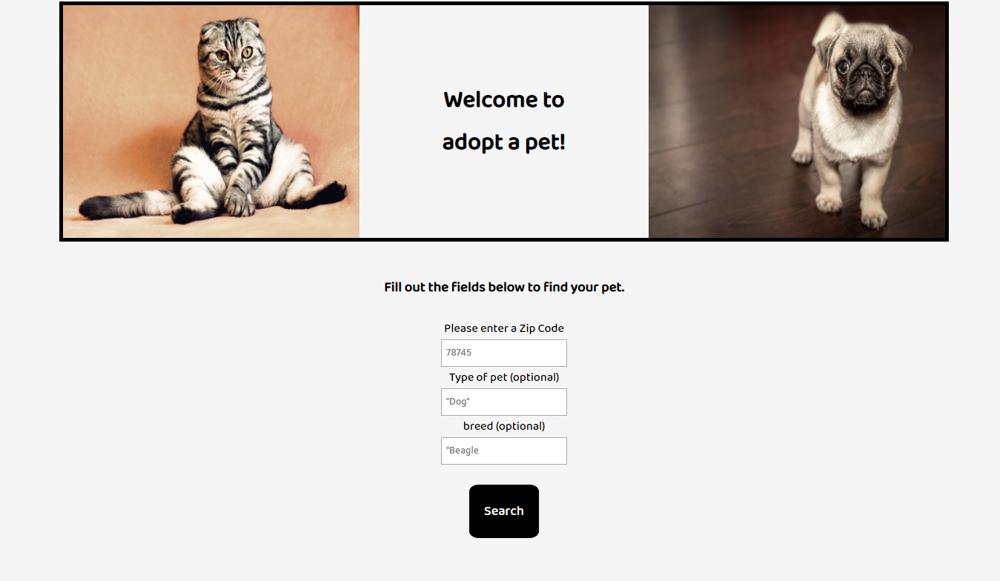
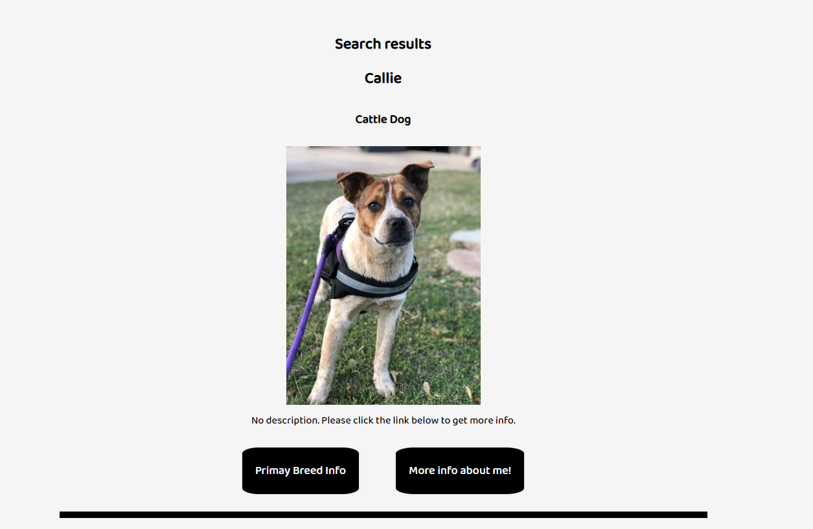
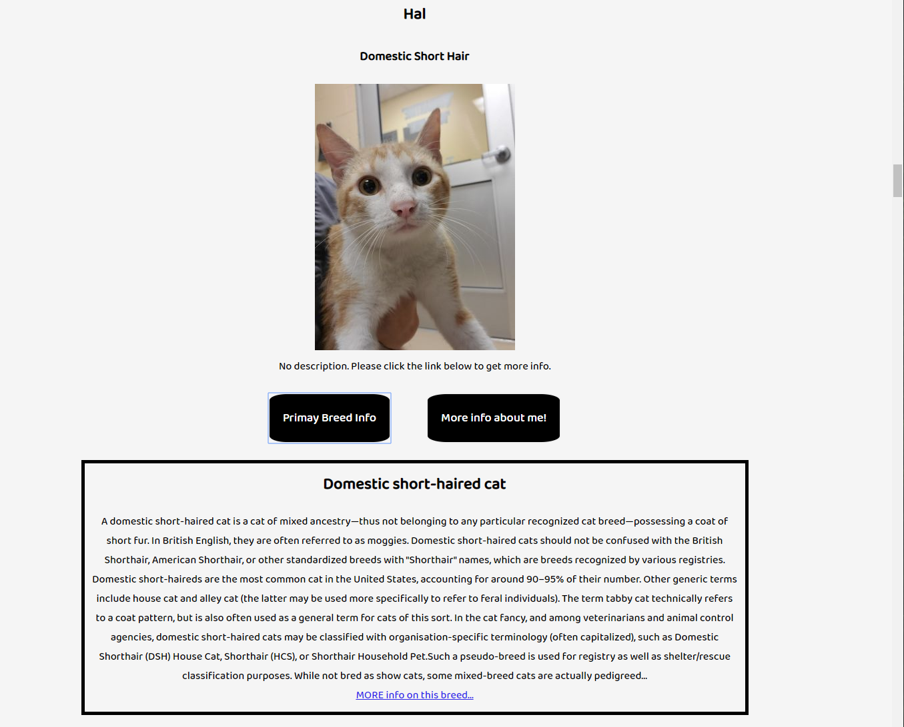

Name: Adopt a pet

Live Link:  https://russellmccurdy.github.io/AdoptAPet/

Sections:
First Page:  

Enter the Zip to search for adoptable pets near you
You may also enter the type of pet you are looking for..dog, cat, hamster, etc.
Or the user can search by breed.

Results

Results will display a list of available animals for adoption.  
 They will display the name, breed, and description.  
 If the user clicks on primary Breed Info, then the app will pull from Wiki API and display a description of the breed.  
 Wiki

If the user clicks 'More Info About Me', then the app takes the user to a page where they can adopt the dog.

Technolog Used: HTML, CSS, jQuery, Javascript,
